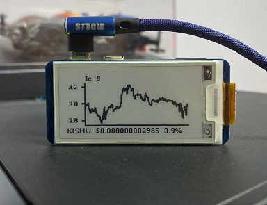

# Crypto-Pi
Unique way of viewing cryptocurrency chart



## Hardware
1. Raspberry Pi Zero WH
2. Waveshare 2.13 inch e-Paper HAT

Only tested with the above combination
## Installation
### 1. Turn on SPI
```commandline
sudo raspi-config
```
Select `Interfacing Options`, `SPI` then select `Yes`
### 2. Install dependencies for Waveshare display
```commandline
sudo apt-get update
sudo apt-get install python3-pip python3-pil python3-numpy
sudo pip3 install RPi.GPIO
```
### 3. Install drivers for Waveshare display
```commandline
git clone https://github.com/waveshare/e-Paper.git
pip3 install ./e-Paper/RaspberryPi_JetsonNano/python/
```
### 4. Download crypto-pi source
```commandline
git clone https://github.com/lumtwj/crypto-pi.git
cd crypto-pi
```
### 5. Install crypto-pi dependencies
```commandline
sudo apt-get install python3-matplotlib
```
## Setup
### 1. Schedule crypto-pi to display chart on boot
```commandline
sudo cp crypto-pi.service /lib/systemd/system/crypto-pi.service
sudo systemctl enable crypto-pi
```
### 2. Start crypto-pi service
```commandline
sudo systemctl start crypto-pi
```
## Customising
For first time setup, create the sample configuration file
```commandline
cp config-sample.json config.json
```

### 1. Editing configuration file
```commandline
nano config.json
```
### 2. Adding more token
```json
{
  "token_list": ["bitcoin", "ethereum"]
}
```
### 3. Set interval to rotate token
Interval unit in seconds
```json
{
  "interval": 300
}
```
